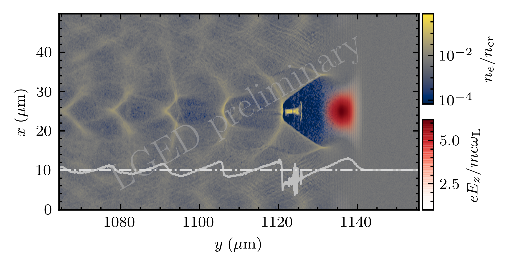

# Density-field plotter
Density-field plotter plot the density and laser field in the same picture.
The field includes the laser electric field in the laser polarization direction and longitudinal electric field along the simulation box.

To run, `python rho_electric.py`. To generate the corresponding `jupyter notebook`, we use [`jupytext`](https://github.com/mwouts/jupytext). 

To generate a jupyter notebook from a Python script, do:

```console
jupytext rho_electric.py --to ipynb
```

One then has to delete the original Python script, which will be re-generated by Jupyter.

For `LaTeX` font rendering of `matplotlib` figures, under `Ubuntu 20.04`:

```console
$ sudo apt install dvipng texlive-latex-extra texlive-fonts-recommended cm-super
```



The script is developed for the generation of plots in the following publications:

- J F Ong, K Seto, A C Berceanu, S Aogaki and L Neagu, Feasibility studies of an all-optical and compact γ-ray blaster using a 1 PW laser pulse, 2019 Plasma Phys. Control. Fusion 61 084009.
- I Tazes, J F Ong, O Tesileanu, K A Tanaka, N A Papadogiannis, M Tatarakis and V Dimitriou, Target normal sheath acceleration and laser wakefield acceleration particle-in-cell simulations performance on CPU & GPU architectures for high-power laser systems, 2020 Plasma Phys. Control. Fusion 62 094005.
